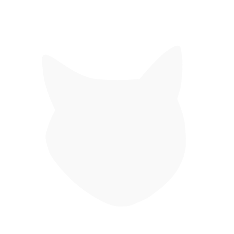

  

<h1 align="center">nineb1ts</h1>

  <code>curiosity is compiling...</code>

---

## About me

I'm an aspiring software developer from Germany, currently completing my apprenticeship as an IT specialist for application development.

My path into software development wasn't exactly linear. I first encountered HTML and CSS during my apprenticeship in marketing communication, later studied Business Administration and worked outside of tech before deciding to change direction.

After attending WBS Coding School, I started my apprenticeship in application development — and haven't stopped building things since.

I'm particularly interested in backend development, software architecture and building applications from the ground up.

## Tech

I currently work with and learn:

- C# / .NET
- ASP.NET Core
- React
- TypeScript
- JavaScript
- HTML / CSS
- PostgreSQL
- Git

## Selected Projects

### [nineb1ts.de](https://nineb1ts.de)

My personal portfolio and playground.

Built with React, TypeScript, Vite and CSS.

[Source](https://github.com/nineb1ts/nineb1ts.de)

---

### [nineth1ngs](https://github.com/nineb1ts/nineth1ngs)

A minimalist desktop task manager focused on organizing tasks, subtasks and focused work.

Built with C#, .NET and WPF.

---

### [Definitely Not Tic-Tac-Toe](https://github.com/nineb1ts/definitely-not-tic-tac-toe)

A small 4×4 strategy game where the goal is to **avoid** getting three in a row.

Built with JavaScript, HTML and CSS.

## Currently

- 🎓 Training as an IT specialist for application development
- 🛠️ Building projects to improve my C#/.NET and web development skills
- 🧠 Learning more about software architecture and clean application design
- 🐈 Probably debugging something

## Find me

🌐 [nineb1ts.de](https://nineb1ts.de)
